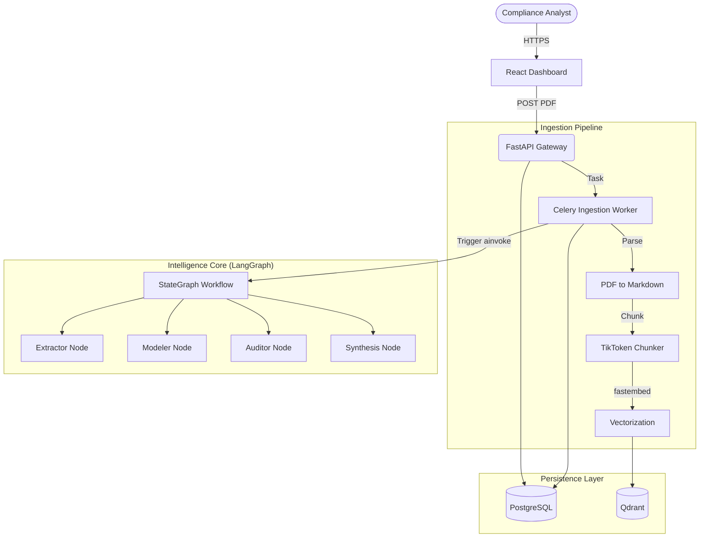
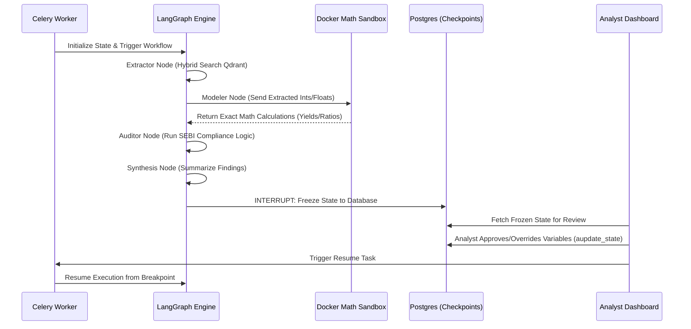

# CAACE - Corporate Action Agentic Compliance Engine


**Unveiling Truth in Financial Filings. Accountability over Autonomy.**

CAACE is a next-generation financial compliance platform that fuses **Agentic RAG**, **Deterministic Workflows (LangGraph)**, and **Sandboxed Execution** to process complex corporate actions like Buybacks and Demergers. Beyond simple extraction, CAACE acts as an automated paralegal—calculating yields, flagging regulatory violations, and summarizing insights while keeping a human firmly in the loop.

**Stack:** FastAPI, LangGraph, Celery, PostgreSQL, Qdrant, Groq (Llama-3).

---

## 🌟 Project Overview

### 🚩 Problem Statement
Financial analysts and compliance teams are drowning in 50+ page regulatory PDFs, but standard AI tools fail in this domain.
*   **Math Hallucinations**: Standard LLMs cannot reliably calculate yields, ratios, or premiums from extracted text.
*   **LLM Autonomy is Dangerous**: ReAct pipelines allow the AI to decide what to do. In compliance, you cannot trust an AI to "decide" if it should run an audit.
*   **Lack of Accountability**: When a standard RAG pipeline gets a number wrong, the entire downstream analysis is corrupted without giving the human a chance to intervene.

### 🎯 Our Solution
**CAACE** acts as a strictly deterministic, highly accountable co-pilot for financial document processing.

1.  **Deterministic Agentic Workflow**: Uses a hardcoded `StateGraph` (LangGraph) that forces a strict sequence: Extraction → Modeling → Auditing → Synthesis.
2.  **Isolated Math Sandboxing**: LLMs extract the numbers, but pure Python calculates the math inside a network-disabled Docker container.
3.  **Automated Compliance Auditing**: Hardcoded rules (e.g., SEBI timelines) automatically flag legal violations based on the extracted data.
4.  **Advanced Human-In-The-Loop (HITL)**: The system intentionally pauses mid-execution, freezing its state to PostgreSQL so a human can correct any data before the final synthesis is generated.

---

## 🏗️ System Architecture

### 🏛️ High-Level Architecture


### 🧠 The Intelligence Pipeline
How we turn 50-page PDFs into actionable, compliant intelligence.



---

## ✨ Core Features Explained

### 🚀 Deterministic LangGraph Execution
*The rigid brain of CAACE.*

Unlike ReAct agents that guess what tool to use, CAACE uses a strict StateGraph.
*   The workflow guarantees that extraction happens first, math happens second, and auditing happens third. 
*   This predictable execution is absolutely required for enterprise compliance environments.

### 💼 Isolated Docker Math Sandboxing
*Zero math hallucinations.*

LLMs are terrible at arithmetic. 
*   **Execution**: The LLM only extracts raw strings (e.g., "1500").
*   **Security**: These numbers are passed to a proprietary Sandbox Tool that spins up a completely isolated, read-only Docker container.
*   **Accuracy**: The container runs pure Python math scripts and returns the exact yield, meaning 100% mathematical accuracy on financial models.

### 🛡️ Human-In-The-Loop (HITL) State Mutation
*Accountability built-in.*

In financial compliance, humans must have the final say.
*   **The Breakpoint**: Before final synthesis, the graph hits an `interrupt_before=["human_review"]` node.
*   **State Freezing**: LangGraph uses `AsyncPostgresSaver` to perfectly serialize the entire state dictionary as a blob in PostgreSQL, allowing the Celery worker to shut down.
*   **Time Travel**: When an analyst corrects an AI mistake via the API, CAACE overwrites the PostgreSQL checkpoint via `aupdate_state`, resets the routing, and resumes the graph using the verified data.

### 📊 Intelligent Markdown Chunking
*Finding needles in haystacks.*

Raw text splitting destroys financial tables.
*   **Boundary Chunking**: Markdown is intelligently chunked using `tiktoken` with a strict limit of **512 tokens** and a **64 token overlap**, respecting headers and list boundaries.
*   **Event Isolation**: Qdrant uses payload indexing to guarantee that a search for Event A never accidentally retrieves data from Event B.
*   **Offset Mapping**: The pipeline maps markdown character offsets back to the raw PDF for exact UI highlighting.

---

## 🛠️ Technology Stack

### 🧠 AI & Orchestration
*   **LangGraph** — Core orchestration framework for the deterministic StateGraph workflow.
*   **Groq (Llama-3.1-8b)** — Blazing fast LLM inference for extraction and synthesis.
*   **FastEmbed** — On-the-fly dense embedding generation (`BAAI/bge-small-en-v1.5`).
*   **TikToken** — Intelligent token-aware markdown chunking.

### ⚙️ Backend & Infrastructure
*   **FastAPI & Uvicorn** — High-performance async API gateway.
*   **Celery & Redis** — Background task queue and message broker for async pipeline execution.
*   **PostgreSQL** — Relational database for events, variables, and LangGraph checkpoints (`langgraph-checkpoint-postgres`).
*   **Qdrant** — Async-native vector database for semantic chunk storage.
*   **Docker** — Full-stack containerization and isolated Math Sandbox execution.

---

## 🔌 API Endpoints

### Ingestion
*   `POST /api/v1/ingest/disclosure` — Uploads PDF, creates DB record, and queues the Celery ingestion worker.

### Human-in-the-Loop (Dashboard)
*   `GET /api/v1/dashboard/events/{event_id}/review` — Fetches the frozen LangGraph state from the Postgres checkpoint for human review.
*   `POST /api/v1/dashboard/events/{event_id}/approve` — Mutates the checkpoint with human corrections and triggers the Celery resume worker.

---

## 🚀 Quick Start

### Prerequisites
*   Python 3.12+
*   Docker & Docker Compose
*   Redis, Qdrant, and PostgreSQL instances running.

### Installation

1.  **Clone the Repository**
    ```bash
    git clone https://github.com/heisenbug-collective/caace-system-core.git
    cd caace-system-core
    ```

2.  **Environment Variables**
    Create a `.env` file in the root directory based on `.env.example`:
    ```env
    GROQ_API_KEY=
    POSTGRES_USER=
    POSTGRES_PASSWORD=
    POSTGRES_DB=
    DATABASE_URL=
    QDRANT_URL=
    CELERY_BROKER_URL=
    UPLOAD_DIR=
    ```

3.  **Run Locally**
    ```bash
    # Install dependencies
    python -m venv .venv
    source .venv/bin/activate
    pip install -r requirements.txt
    
    # Start the API
    uvicorn src.api.main:app --host 0.0.0.0 --port 8000
    
    # Start the Celery Worker (In another terminal)
    celery -A src.workers.celery_app worker --loglevel=info
    ```

---

## 🤝 Project Team

| Name | Role |
| :--- | :--- |
| **Aryan Agarwal** | **Backend Development & AI**|
| **Swastik Gupta** | **Backend Development & AI**|

---


